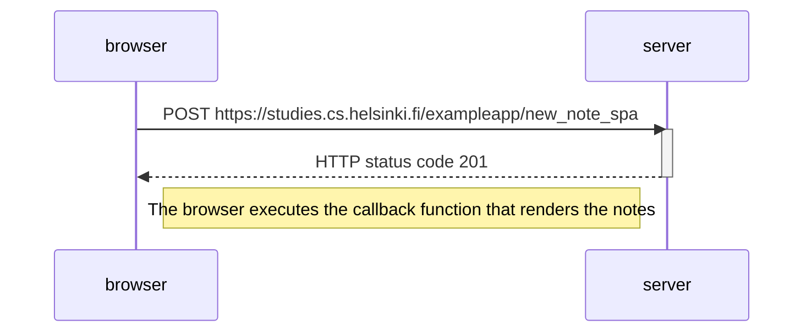

## 0.6: SPA New Note Diagram

 

```mermaid
sequenceDiagram
participant browser
participant server

    browser->>server: POST https://studies.cs.helsinki.fi/exampleapp/new_note_spa
    activate server
    server-->>browser: HTTP status code 201
    deactivate server

    Note right of browser: The browser executes the callback function that renders the notes


```
